# Thermostat Knob - CrowPanel ESP32-S3 Rotary Displays

A round rotary smart display that controls your thermostat, lights, and
covers straight from Home Assistant — no phone, no app, just a knob you turn
and press. Built on ESPHome for Elecrow's CrowPanel ESP32-S3 rotary
displays.

Flash it in the browser, point it at Home Assistant, and it's ready to use.
See [SETUP.md](SETUP.md) for building, flashing, and Home Assistant
configuration.

## Video Walkthrough

| 1.28" (240x240) | 2.1" (480x480) |
|---|---|
|  |  |

Replace `REPLACE_WITH_240_VIDEO_ID` and `REPLACE_WITH_480_VIDEO_ID` with the
actual YouTube video IDs once the walkthroughs are recorded.

## Screens

| Loading | Home | Thermostat |
|---|---|---|
| 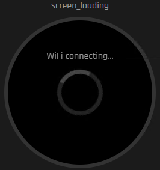 | 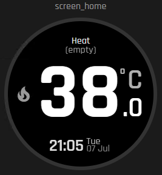 | 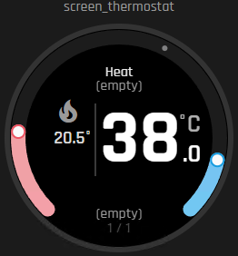 |

| Light brightness | Light temperature | Light color |
|---|---|---|
| 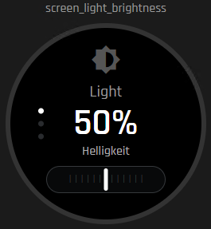 | 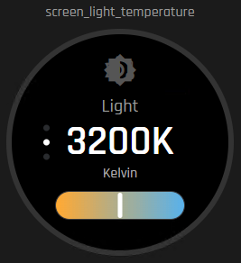 | 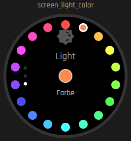 |

| Cover | Entity navigation |
|---|---|
| 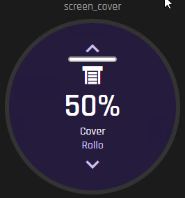 | 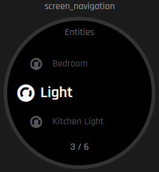 |

## Features

- Shows current and target temperature, with a large readout and a circular
  setpoint ring.
- Turn the knob to change the target temperature, HVAC mode, or preset.
- Works with a thermostat-only setup, an AC-only setup, or a combined
  heat/cool climate entity, including dual-setpoint entities.
- Controls Home Assistant lights: brightness, color temperature, and color,
  with a dedicated screen for each.
- Controls Home Assistant covers (shutters, blinds, curtains): position,
  stop, and one-swipe full open/close.
- One shared entity overview to jump between any configured thermostat,
  light, or cover.
- Shows the Home Assistant connection state right on the display.
- Flash from the browser and configure Wi-Fi without installing anything —
  see the [Web Flasher](SETUP.md#web-flasher).

No extra Home Assistant automation YAML is required for the basic control
flow — the firmware talks to Home Assistant directly over the native
ESPHome API.

## Hardware

| CrowPanel 1.28" (240x240) | CrowPanel 2.1" (480x480) |
|---|---|
| [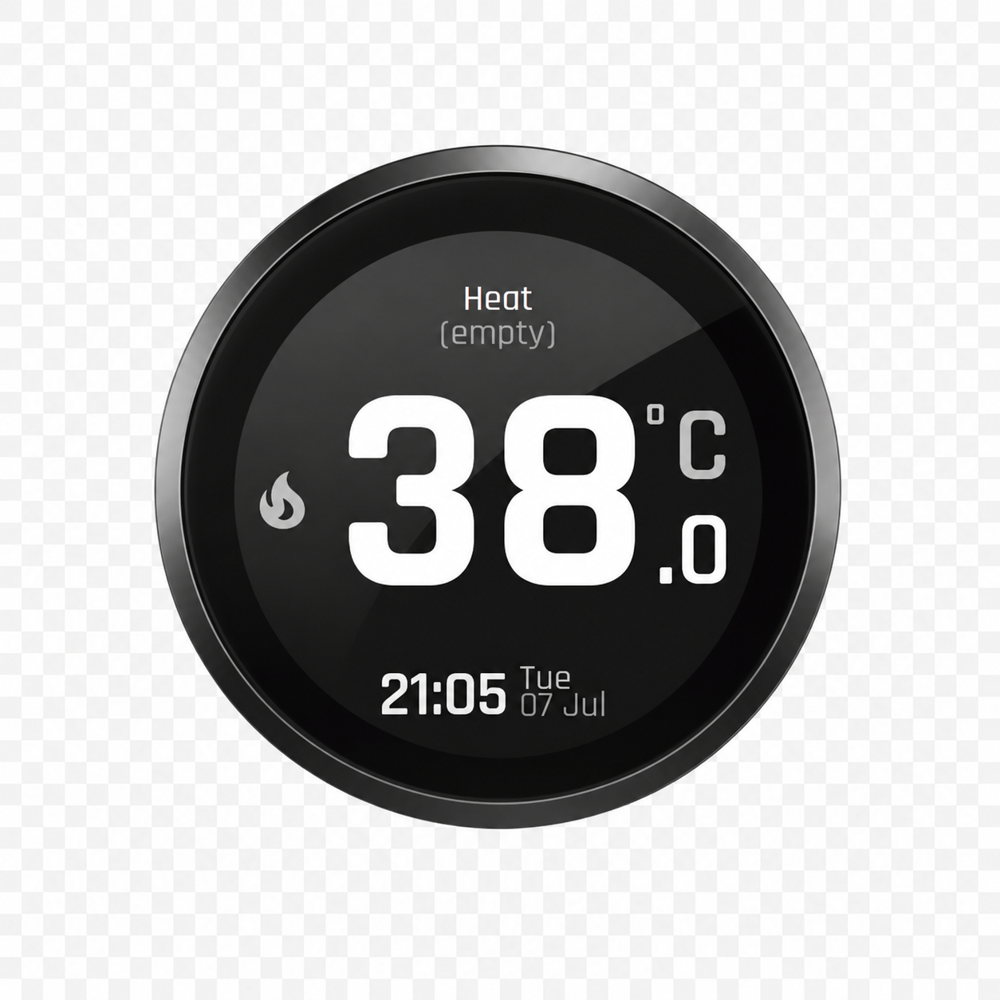](https://www.elecrow.com/crowpanel-1-28inch-hmi-esp32-rotary-display-240-240-ips-round-touch-knob-screen.html) | [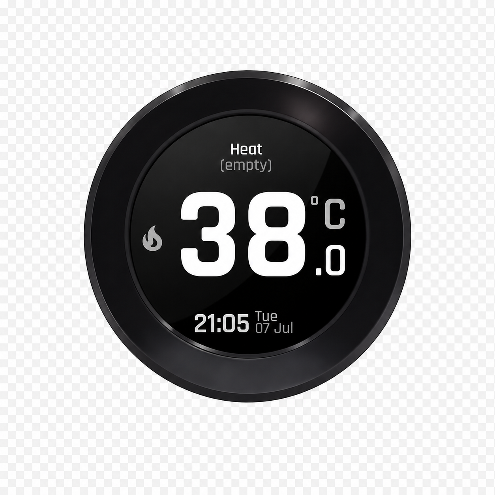](https://www.elecrow.com/crowpanel-2-1inch-hmi-esp32-rotary-display-480-480-ips-round-touch-knob-screen.html) |

- [Elecrow CrowPanel 2.1" HMI ESP32-S3 rotary display, 480x480](https://www.elecrow.com/crowpanel-2-1inch-hmi-esp32-rotary-display-480-480-ips-round-touch-knob-screen.html)
- [Elecrow CrowPanel 1.28" HMI ESP32-S3 rotary display, 240x240](https://www.elecrow.com/crowpanel-1-28inch-hmi-esp32-rotary-display-240-240-ips-round-touch-knob-screen.html)
- Built-in rotary encoder with push button
- Touch display

## What the Integration Does

The **Smart Thermostat Knob** custom integration is an optional,
HACS-installable Home Assistant integration that picks which entities show
up on the device — no manual entity IDs or JSON. It lives in its own
repository so it can be installed and updated independently of the
firmware: **[Jastreb07/elecrow-crowpanel-esphome-thermostat-integration](https://github.com/Jastreb07/elecrow-crowpanel-esphome-thermostat-integration)**.

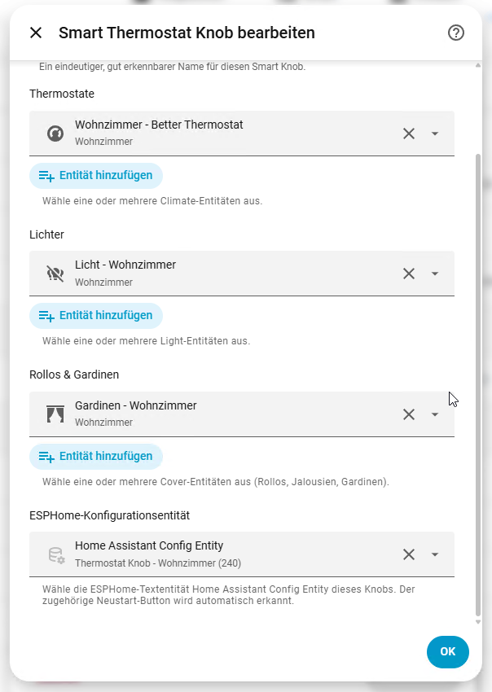

With it installed you can, per physical Smart Knob:

- Pick any number of climate, light, and cover entities through Home
  Assistant's native entity selectors.
- Give the knob a friendly name; the integration derives a unique config
  sensor entity ID from it (for example `sensor.living_room_knob_config`).
- Point the integration at the device's **Home Assistant Config Entity**
  text entity so it auto-writes the sensor entity ID into the ESP and
  restarts it — no manual copy-pasting between HA and the device.
- **Reconfigure** an existing knob later (rename it or change its entity
  list), and run multiple independent Smart Knobs from one Home Assistant
  instance, each with its own entry.

It's a configuration helper only — it doesn't add new entities to Home
Assistant, doesn't talk to the ESP device over the network, and adds no
extra automations. Installation and the full config-flow walkthrough are in
the [integration repo's README](https://github.com/Jastreb07/elecrow-crowpanel-esphome-thermostat-integration#readme);
the manual Template-Entity alternative (no integration needed) is in
[SETUP.md](SETUP.md#home-assistant-setup).

## Controls

| Action | Result |
|---|---|
| Rotate encoder | Change the current thermostat, light, cover, or menu value |
| Short press | Switch the TRV/AC target, the light control mode, or stop a moving cover |
| Double click | Jump to thermostat or switch its active target |
| Hold 800 ms on thermostat | Toggle HVAC off/on and restore its last mode |
| Hold 800 ms on a light page | Toggle the selected light on/off |
| Hold 800 ms on a cover page | Jump back to the thermostat |
| Hold 800 ms on the settings page | Go back one menu level |
| Swipe (light/cover pages) | Open settings or the entity overview |
| Swipe (cover page, second axis) | Fully open or close the cover |
| Touch the display | Wake the display |

Temperature changes are debounced. The UI updates immediately, but
`climate.set_temperature` is sent only after a short quiet period.

## Roadmap

Done:

- [x] Thermostat control (single- and dual-setpoint, HVAC mode, presets)
- [x] Light control (brightness, color temperature, color)
- [x] Cover control (position, stop, full open/close)
- [x] Shared entity overview and settings navigation
- [x] Optional custom Home Assistant integration for entity selection
- [x] Local LVGL HTML preview tool
- [x] Browser-based Web Flasher with Improv Wi-Fi setup

Planned:

- [ ] Fan control screen (speed, oscillate, preset)
- [ ] Media player screen (volume, play/pause, track skip)
- [ ] Per-page idle timeout / screen-saver customization
- [ ] Additional language packs for on-device text

Have a feature request? Open an issue with your use case.

## Documentation

- [SETUP.md](SETUP.md) — toolchain install, building/flashing firmware, the
  Web Flasher, the LVGL preview tool, and Home Assistant configuration.
- [elecrow-crowpanel-esphome-thermostat-integration](https://github.com/Jastreb07/elecrow-crowpanel-esphome-thermostat-integration) —
  the companion Home Assistant integration's own repository and README
  (HACS or manual install).
- [web-flasher/README.md](web-flasher/README.md) — exporting firmware
  binaries and publishing the Web Flasher page.
- [docs/UI_CONCEPT.md](docs/UI_CONCEPT.md) — screen model, interaction
  model, colors, and component naming for contributors.
